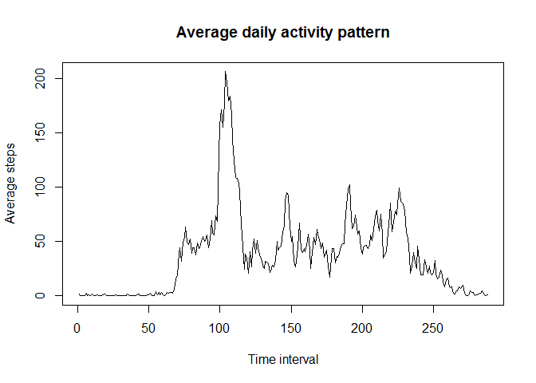
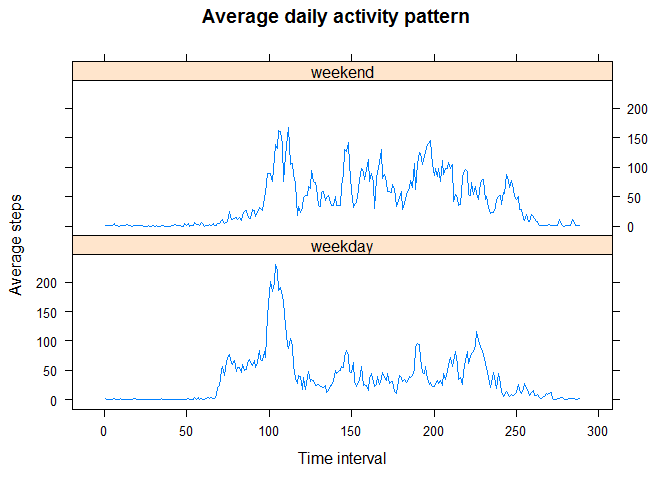

# Reproducible Research - Week 2 - Course Project 1


## Read in the Data


```r
url <- "https://d396qusza40orc.cloudfront.net/repdata%2Fdata%2Factivity.zip"
download.file(url, destfile = "repdata%2Fdata%2Factivity.zip")
rda <- read_delim("repdata%2Fdata%2Factivity.zip", ",", na = "NA")
```

```
## Parsed with column specification:
## cols(
##   steps = col_integer(),
##   date = col_date(format = ""),
##   interval = col_integer()
## )
```

## Plot the total number of steps taken each day


```r
png(filename = "hist_daily_steps.png",
    width = 480, height = 480, units = "px", pointsize = 12,
    bg = "white", res = NA, family = "", restoreConsole = TRUE,
    type = c("windows", "cairo", "cairo-png"))

bydate <- aggregate(rda$steps, by=list(Date = rda$date), FUN = sum, na.action = NULL)
hist(bydate$x, breaks = 20, main = "Frequency of Daily Step Count", 
     xlab = "Total Daily Steps", ylab = "Frequency")

dev.off()
```

```
## png 
##   2
```

```r
bydate <- aggregate(rda$steps, by=list(Date = rda$date), FUN = sum, na.action = NULL)
hist(bydate$x, breaks = 20, main = "Frequency of Daily Step Count", 
     xlab = "Total Daily Steps", ylab = "Frequency")
```

<!-- -->

## Mean and median number of steps taken each day


```r
summary(rda$steps)
```

```
##    Min. 1st Qu.  Median    Mean 3rd Qu.    Max.    NA's 
##    0.00    0.00    0.00   37.38   12.00  806.00    2304
```

## Average daily activity pattern


```r
byint <- aggregate(steps ~ interval, data = rda, mean)

## I added a column for the row number of the interval, as the intervals have big gaps for each hundreds
## value - from 55 to 0 of the next hundreds value

byint$row <- row(byint[1])
plot(byint$row, byint$steps, type = "l", main = "Average daily activity pattern", xlab = "Time interval", ylab = "Average steps")
```

<!-- -->

### Find interval with maximum average steps:


```r
byint[which.max(byint$steps), 1:2]
```

```
##     interval    steps
## 104      835 206.1698
```

## Input missing values:


```r
## The number of missing values:
paste("The number of missing values in the dataset is:", sum(is.na(rda)))
```

```
## [1] "The number of missing values in the dataset is: 2304"
```

## Replace "NA" values in the dataset with the *average value for that interval*

```r
## First, the data is reshaped:
mlt <- melt(rda, id=2:3)
new <- cast(mlt, interval~date)

## Then, NA values are replaced:

for (j in 2:dim(new)[2]){ ## for each column, excluding the first one which is the interval
        for (i in 1:dim(new)[1]){ ## for each row
      
                if (is.na(new[i,j]) == "TRUE"){
                        new[i,j] <- byint[i,2]
                }
        }
}

## Verify all NA values are gone: 
paste("the number of 'NA' values in this data set is", sum(is.na(new)))
```

```
## [1] "the number of 'NA' values in this data set is 0"
```

```r
## Now repeat the histogram calculations for the new dataset
## First the dataset must be "re-melted"

mlt <- melt(new, id=1)
rownames(mlt) <- row(mlt[1])

bydat <- aggregate(mlt$value, by=list(Date = rda$date), FUN = sum)

hist(bydat$x, breaks = 20, ylim=c(0,20), xlim = c(0,20000),
     main = "Frequency of Daily Step Count", 
     xlab = "Total Daily Steps", ylab = "Frequency")
```

<!-- -->

```r
## and report the mean and median of the adjusted dataset

summary(mlt$value)
```

```
##    Min. 1st Qu.  Median    Mean 3rd Qu.    Max. 
##    0.00    0.00    0.00   37.38   27.00  806.00
```

## What was the impact of replacing the missing values?


```r
## Plot the "before" and "after" histograms together and visually compare
par(mfrow = c(1,2))
hist(bydate$x, breaks = 20, main = "Frequency of Daily Step Count", ylim = c(0,20), 
      xlab = "Total Daily Steps - with NA values", ylab = "Frequency")
 hist(bydat$x, breaks = 20, ylim=c(0,20), xlim = c(0,20000),
      main = "Frequency of Daily Step Count", 
      xlab = "Total Daily Steps - without NA values", ylab = "Frequency")
```

<!-- -->
 
 We can see that the "bell" shape of the graph has gotten narrower and higher in amplitude.  
 As for the mean and median values, these values are unchanged.
 
 ## Are there differences between weekdays and weekends?
 

```r
## Add the category for if a day is a weekday or weekend
mlt$day <- weekdays(mlt$date, abbreviate = TRUE)
mlt$end <- "weekday"
mlt[grep("Sat", mlt$day),5] <- "weekend"
mlt[grep("Sun", mlt$day),5] <- "weekend"
mlt$end <- as.factor(mlt$end)

## Aggregate the data, finding the mean over each interval and "end" factor
byin <- aggregate(value ~ interval + end, data = mlt, mean)
byin$row <- row(byin[1]) ## Again, the "interval" values have big gaps, so we are using rows (i.e. interval numbers) to plot
        byin[289:576,4] <- byin[1:288, 4] ##Have to subtract 288 because rows are duplicated (for 2 factors)
        
xyplot(value ~ row | end, data = byin, type = "l", layout = c(1,2), 
       main = "Average daily activity pattern", xlab = "Time interval", ylab = "Average steps")
```

<!-- -->
