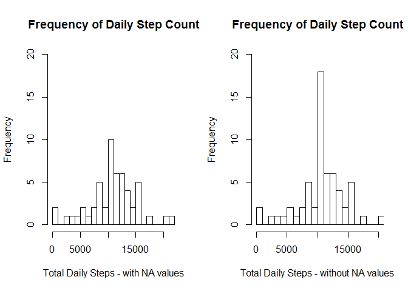

# Reproducible Research - Week 2 - Course Project 1


## Read in the Data


```r
url <- "https://d396qusza40orc.cloudfront.net/repdata%2Fdata%2Factivity.zip"
download.file(url, destfile = "repdata%2Fdata%2Factivity.zip")
rda <- read_delim("repdata%2Fdata%2Factivity.zip", ",", na = "NA")
```

```
## Parsed with column specification:
## cols(
##   steps = col_integer(),
##   date = col_date(format = ""),
##   interval = col_integer()
## )
```

## Plot the total number of steps taken each day


```r
bydate <- aggregate(rda$steps, by=list(Date = rda$date), FUN = sum, na.action = NULL)
hist(bydate$x, breaks = 20, main = "Frequency of Daily Step Count", 
     xlab = "Total Daily Steps", ylab = "Frequency")
```

<!-- -->

## Mean and median number of steps taken each day


```r
mm <- aggregate(rda$steps, by = list(Date = rda$date), 
                FUN = function(x) c(mean = mean(x), median = median(x, na.action = NULL)))
print(mm)
```

```
##          Date     x.mean   x.median
## 1  2012-10-01         NA         NA
## 2  2012-10-02  0.4375000  0.0000000
## 3  2012-10-03 39.4166667  0.0000000
## 4  2012-10-04 42.0694444  0.0000000
## 5  2012-10-05 46.1597222  0.0000000
## 6  2012-10-06 53.5416667  0.0000000
## 7  2012-10-07 38.2465278  0.0000000
## 8  2012-10-08         NA         NA
## 9  2012-10-09 44.4826389  0.0000000
## 10 2012-10-10 34.3750000  0.0000000
## 11 2012-10-11 35.7777778  0.0000000
## 12 2012-10-12 60.3541667  0.0000000
## 13 2012-10-13 43.1458333  0.0000000
## 14 2012-10-14 52.4236111  0.0000000
## 15 2012-10-15 35.2048611  0.0000000
## 16 2012-10-16 52.3750000  0.0000000
## 17 2012-10-17 46.7083333  0.0000000
## 18 2012-10-18 34.9166667  0.0000000
## 19 2012-10-19 41.0729167  0.0000000
## 20 2012-10-20 36.0937500  0.0000000
## 21 2012-10-21 30.6284722  0.0000000
## 22 2012-10-22 46.7361111  0.0000000
## 23 2012-10-23 30.9652778  0.0000000
## 24 2012-10-24 29.0104167  0.0000000
## 25 2012-10-25  8.6527778  0.0000000
## 26 2012-10-26 23.5347222  0.0000000
## 27 2012-10-27 35.1354167  0.0000000
## 28 2012-10-28 39.7847222  0.0000000
## 29 2012-10-29 17.4236111  0.0000000
## 30 2012-10-30 34.0937500  0.0000000
## 31 2012-10-31 53.5208333  0.0000000
## 32 2012-11-01         NA         NA
## 33 2012-11-02 36.8055556  0.0000000
## 34 2012-11-03 36.7048611  0.0000000
## 35 2012-11-04         NA         NA
## 36 2012-11-05 36.2465278  0.0000000
## 37 2012-11-06 28.9375000  0.0000000
## 38 2012-11-07 44.7326389  0.0000000
## 39 2012-11-08 11.1770833  0.0000000
## 40 2012-11-09         NA         NA
## 41 2012-11-10         NA         NA
## 42 2012-11-11 43.7777778  0.0000000
## 43 2012-11-12 37.3784722  0.0000000
## 44 2012-11-13 25.4722222  0.0000000
## 45 2012-11-14         NA         NA
## 46 2012-11-15  0.1423611  0.0000000
## 47 2012-11-16 18.8923611  0.0000000
## 48 2012-11-17 49.7881944  0.0000000
## 49 2012-11-18 52.4652778  0.0000000
## 50 2012-11-19 30.6979167  0.0000000
## 51 2012-11-20 15.5277778  0.0000000
## 52 2012-11-21 44.3993056  0.0000000
## 53 2012-11-22 70.9270833  0.0000000
## 54 2012-11-23 73.5902778  0.0000000
## 55 2012-11-24 50.2708333  0.0000000
## 56 2012-11-25 41.0902778  0.0000000
## 57 2012-11-26 38.7569444  0.0000000
## 58 2012-11-27 47.3819444  0.0000000
## 59 2012-11-28 35.3576389  0.0000000
## 60 2012-11-29 24.4687500  0.0000000
## 61 2012-11-30         NA         NA
```

## Average daily activity pattern


```r
byint <- aggregate(steps ~ interval, data = rda, mean)

## I added a column for the row number of the interval, as the intervals have big gaps for each hundreds
## value - from 55 to 0 of the next hundreds value

byint$row <- row(byint[1])
plot(byint$row, byint$steps, type = "l", main = "Average daily activity pattern", xlab = "Time interval", ylab = "Average steps")
```

<!-- -->

### Find interval with maximum average steps:


```r
byint[which.max(byint$steps), 1:2]
```

```
##     interval    steps
## 104      835 206.1698
```

## Input missing values:


```r
## The number of missing values:
paste("The number of missing values in the dataset is:", sum(is.na(rda)))
```

```
## [1] "The number of missing values in the dataset is: 2304"
```

## Replace "NA" values in the dataset with the average value for that interval

```r
## First, the data is reshaped:
mlt <- melt(rda, id=2:3)
new <- cast(mlt, interval~date)

## Then, NA values are replaced:

for (j in 2:dim(new)[2]){ ## for each column, excluding the first one which is the interval
        for (i in 1:dim(new)[1]){ ## for each row
      
                if (is.na(new[i,j]) == "TRUE"){
                        new[i,j] <- byint[i,2]
                }
        }
}

## Verify all NA values are gone: 
paste("the number of 'NA' values in this data set is", sum(is.na(new)))
```

```
## [1] "the number of 'NA' values in this data set is 0"
```

```r
## Now repeat the histogram calculations for the new dataset
## First the dataset must be "re-melted"

mlt <- melt(new, id=1)
rownames(mlt) <- row(mlt[1])

bydat <- aggregate(mlt$value, by=list(Date = rda$date), FUN = sum)

hist(bydat$x, breaks = 20, ylim=c(0,20), xlim = c(0,20000),
     main = "Frequency of Daily Step Count", 
     xlab = "Total Daily Steps", ylab = "Frequency")
```

<!-- -->

```r
## and report the mean and median of the adjusted dataset

mmm <- aggregate(mlt$value, by = list(Date = rda$date), 
                FUN = function(x) c(mean = mean(x), median = median(x)))
print(mmm)
```

```
##          Date     x.mean   x.median
## 1  2012-10-01 37.3825996 34.1132075
## 2  2012-10-02  0.4375000  0.0000000
## 3  2012-10-03 39.4166667  0.0000000
## 4  2012-10-04 42.0694444  0.0000000
## 5  2012-10-05 46.1597222  0.0000000
## 6  2012-10-06 53.5416667  0.0000000
## 7  2012-10-07 38.2465278  0.0000000
## 8  2012-10-08 37.3825996 34.1132075
## 9  2012-10-09 44.4826389  0.0000000
## 10 2012-10-10 34.3750000  0.0000000
## 11 2012-10-11 35.7777778  0.0000000
## 12 2012-10-12 60.3541667  0.0000000
## 13 2012-10-13 43.1458333  0.0000000
## 14 2012-10-14 52.4236111  0.0000000
## 15 2012-10-15 35.2048611  0.0000000
## 16 2012-10-16 52.3750000  0.0000000
## 17 2012-10-17 46.7083333  0.0000000
## 18 2012-10-18 34.9166667  0.0000000
## 19 2012-10-19 41.0729167  0.0000000
## 20 2012-10-20 36.0937500  0.0000000
## 21 2012-10-21 30.6284722  0.0000000
## 22 2012-10-22 46.7361111  0.0000000
## 23 2012-10-23 30.9652778  0.0000000
## 24 2012-10-24 29.0104167  0.0000000
## 25 2012-10-25  8.6527778  0.0000000
## 26 2012-10-26 23.5347222  0.0000000
## 27 2012-10-27 35.1354167  0.0000000
## 28 2012-10-28 39.7847222  0.0000000
## 29 2012-10-29 17.4236111  0.0000000
## 30 2012-10-30 34.0937500  0.0000000
## 31 2012-10-31 53.5208333  0.0000000
## 32 2012-11-01 37.3825996 34.1132075
## 33 2012-11-02 36.8055556  0.0000000
## 34 2012-11-03 36.7048611  0.0000000
## 35 2012-11-04 37.3825996 34.1132075
## 36 2012-11-05 36.2465278  0.0000000
## 37 2012-11-06 28.9375000  0.0000000
## 38 2012-11-07 44.7326389  0.0000000
## 39 2012-11-08 11.1770833  0.0000000
## 40 2012-11-09 37.3825996 34.1132075
## 41 2012-11-10 37.3825996 34.1132075
## 42 2012-11-11 43.7777778  0.0000000
## 43 2012-11-12 37.3784722  0.0000000
## 44 2012-11-13 25.4722222  0.0000000
## 45 2012-11-14 37.3825996 34.1132075
## 46 2012-11-15  0.1423611  0.0000000
## 47 2012-11-16 18.8923611  0.0000000
## 48 2012-11-17 49.7881944  0.0000000
## 49 2012-11-18 52.4652778  0.0000000
## 50 2012-11-19 30.6979167  0.0000000
## 51 2012-11-20 15.5277778  0.0000000
## 52 2012-11-21 44.3993056  0.0000000
## 53 2012-11-22 70.9270833  0.0000000
## 54 2012-11-23 73.5902778  0.0000000
## 55 2012-11-24 50.2708333  0.0000000
## 56 2012-11-25 41.0902778  0.0000000
## 57 2012-11-26 38.7569444  0.0000000
## 58 2012-11-27 47.3819444  0.0000000
## 59 2012-11-28 35.3576389  0.0000000
## 60 2012-11-29 24.4687500  0.0000000
## 61 2012-11-30 37.3825996 34.1132075
```

## What was the impact of replacing the missing values?


```r
## Plot the "before" and "after" histograms together and visually compare
par(mfrow = c(1,2))
hist(bydate$x, breaks = 20, main = "Frequency of Daily Step Count", ylim = c(0,20), 
      xlab = "Total Daily Steps - with NA values", ylab = "Frequency")
 hist(bydat$x, breaks = 20, ylim=c(0,20), xlim = c(0,20000),
      main = "Frequency of Daily Step Count", 
      xlab = "Total Daily Steps - without NA values", ylab = "Frequency")
```

<!-- -->
 
 We can see that the "bell" shape of the graph has gotten narrower and higher in amplitude.  
 As for the mean and median values, there are now values where there were previously not values.  
 Where there were values previously, these values are unchanged.
 
 ## Are there differences between weekdays and weekends?
 

```r
## Add the category for if a day is a weekday or weekend
mlt$day <- weekdays(mlt$date, abbreviate = TRUE)
mlt$end <- "weekday"
mlt[grep("Sat", mlt$day),5] <- "weekend"
mlt[grep("Sun", mlt$day),5] <- "weekend"
mlt$end <- as.factor(mlt$end)

## Aggregate the data, finding the mean over each interval and "end" factor
byin <- aggregate(value ~ interval + end, data = mlt, mean)
byin$row <- row(byin[1]) ## Again, the "interval" values have big gaps, so we are using rows (i.e. interval numbers) to plot
        byin[289:576,4] <- byin[1:288, 4] ##Have to subtract 288 because rows are duplicated (for 2 factors)
        
xyplot(value ~ row | end, data = byin, type = "l", layout = c(1,2), 
       main = "Average daily activity pattern", xlab = "Time interval", ylab = "Average steps")
```

<!-- -->
